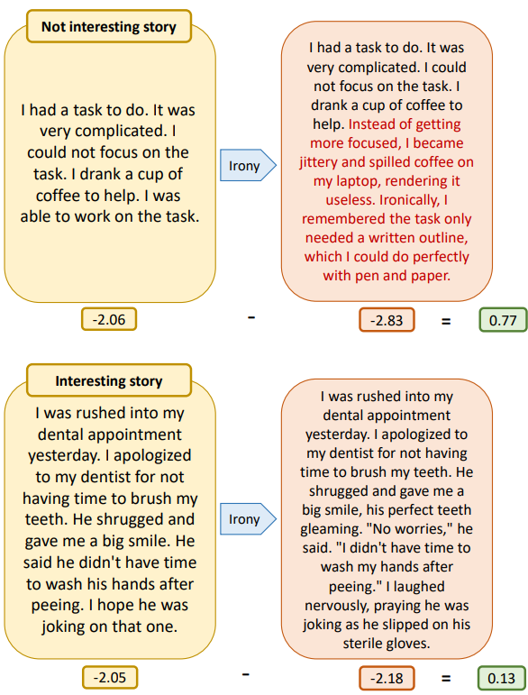
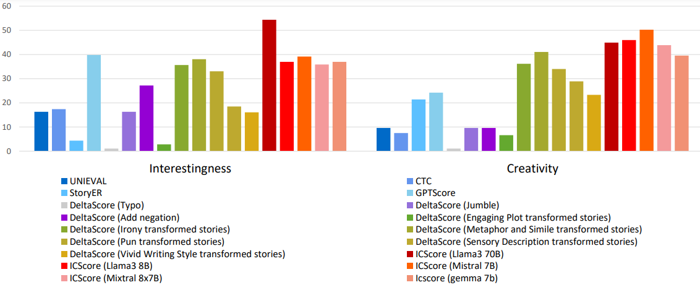

# ICScore: a Metric for Evaluating Interestingness and Creativity of Stories

This repo contains code for ICScore: a Metric for Evaluating Interestingness and Creativity of Stories.




### Preparation
First, download the requirements.txt file.
```
pip install -r requirements.txt
```
Second, you will need an OpenAPI key. Enter your key in the format 'sk-xxxx...' in the .env_sample file.
```
OPENAI_API_KEY='sk-xxxx...'
```
Then, rename the .env_sample file to .env.

## Simple start

If you want to test our metric,

### step 1.
to transformation
```
python transformation.py
```
### step 2.
to calculate likelihood
```
python deltascore.py --data_path 'your data path'
```
### step 3.
to tune weight
```
python weight_tuning.py
```
### step 4.
to merge data
```
python data_merge.py
```
### step 5.
to calculate ICScore
```
python ICScore.py
``` 

## Data

#### datas
Data used during the experiment.

#### human_evaluations
Inhouse and crowdsource evaluation results.

#### results
The results of the weights and overall scores for each transformation, the ICScore, and the human evaution for those scores.